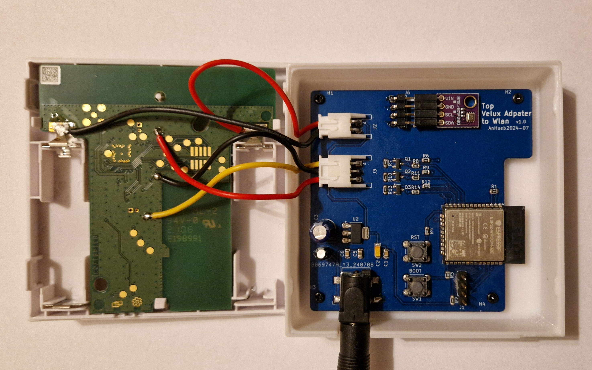

# Velux-ESP32-RemoteController
ESP32 WlanController for Velux KLI 310 Remotecontroller to integrate it into Smarthome like Home Assistant with ESP Home.

This WLan Controller for Velux KLI310 Switch is based on this GitHub Projekt form thorio https://github.com/thorio/esphome-projects/tree/master/velux-controller.

I did a workaround and use an ESP32 controller instead of an ESP8266 (ESP-12F) module.

This board also features an IIC bus socket for connecting a small sensor board to the ESP-32.
I use it with a BME280 module like this 

to transfer the sensor data to Home Assistant

All you need to do is carefully remove the plastic back of the KLI switch and solder 5 wires to the board.

Two wires supplies the KLI board with 3.3V instead of the batteries.
The other 3 wires are for up, stop and down command.

The Voltagesupply is an 5V USB Smartphone Charger

Partlist:

- 1   CLIFF FC68148S     Einbaukupplung SMD, 6,4 x 2,1 mm
- 2   TPS 3216 22/6,3    MD-Tantal Kondensator, 22µF, 6,3V
- 2   TASTER 3301        Kurzhubtaster 6x6mm, Höhe: 4,3mm, 12V, vertikal
- 1   LM 1117 IMP-3.3    LDO-Spannungsregler, fix, 3,3 V, 800mA, SOT-223
- 1   KEM X5R0805 10U    Vielschicht-Kerko, 10µF, 10V, 85°C
- 2   WAL 0805B104K500   SMD-Kerko, 0805, 100 nF, 50V, 10%, X7R, MLCC
- 1   ESP32WROOM32E      WIFI-SMD-Modul, ESP32-D0WD-V3, 4 MB SPI, 3,3 V, 18 x 25,5 x 3,1
- 3   MMBT 3904LT1G      Bipolartransistor, NPN, 40V, 0,2A, 0,225W, SOT-23
- 1   M-A 470U 6,3       Elko, radial, 470 µF, 6,3 V, RM 2,5, 85°C, 2000h, 20%
- 1   SM 10/16RAD        Subminiatur-Elko, radial, 10 µF, 16 V, RM 1,5, 85°C, 1000h, 20%
- 8   WAL WR08X1001FTL   SMD-Widerstand, 0805, 1 kOhm, 125 mW, 1%
- 5   WAL WR08X1002FTL   SMD-Widerstand, 0805, 10 kOhm, 125 mW, 1%
- 1   JST XH3P ST90      JST - Stiftleiste, 90°, 1x3-polig - XH
- 1   JST XH2P ST90      JST - Stiftleiste, 90°, 1x2-polig - XH
- 1   W+P 946-124        Stiftleiste RM 2,54mm, gewinkelt, 1-reihig, 4-polig
- 1   MPE 087-1-004      Stiftleisten 2,54 mm, 1X04, gerade
- 1   DELOCK 82197       USB Konverter, A Stecker auf 1x Hohlstecker, 1 m

Firmware:
code.yaml

Thanks to:

https://github.com/thorio/esphome-projects/tree/master/velux-controller

Disclaimer:

Any reconstruction and operation of the Hardware, PCB and Software is at your own risk.
