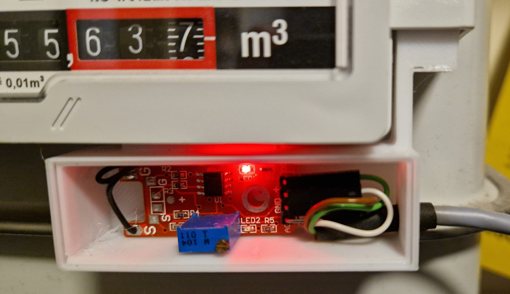

# Gaszählimpuls-Sensor
This sensor is used to detect the magnetic sensor on a gas meter.
The sensor consists of a purchased reed contact PCB-board such as:

KY-025 Magnetschalter Reed Sensor Modul 
https://www.google.com/search?client=firefox-b-d&q=KY-025+Magnetschalter+Reed+Sensor+Modul

The reed contact must be unsoldered and then extended with short cables as shown in the picture.

The reed contact finds its new place in the head of the housing, which can be clipped in under the counter for mounting.

The sensor is only secured with one screw.

The sensor requires a voltage of 3.3V-5V.
I connect the digital output on an ESP12F module like this one.

!!!Attention this module uses mains voltage of 230V AC!!!
Relaismodul, ESP8266 AC 220 V DC 12 V WIFI Relais Schalter
https://www.google.com/search?q=Esp8266%2Bdrahtloses%2Bwifi%2Brelais%2Bcontroller%2Bmodul%2BESP-12F

WiFi Relais Controller Modul, DC 5V 8V-80V
https://www.google.com/search?q=Esp8266+drahtloses+wifi+relais+controller+modul+ESP-12F+dc+5v-80v

Code:

